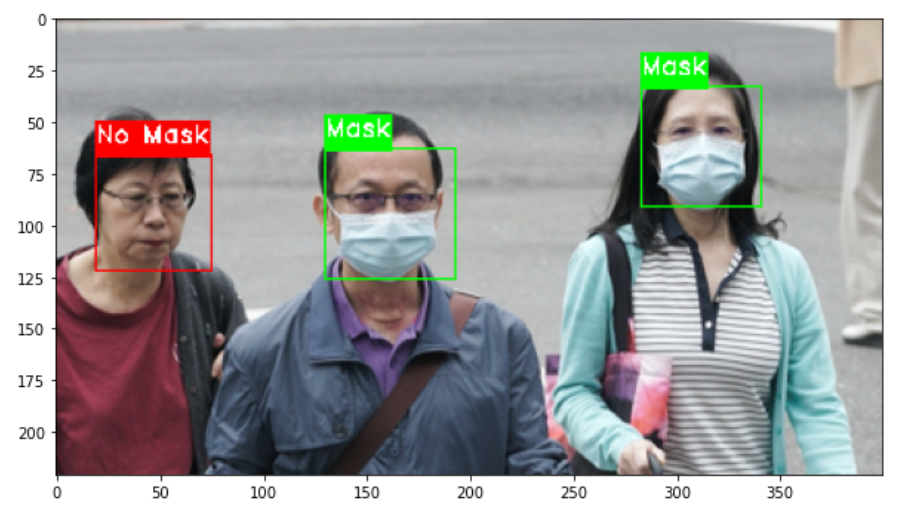

# Deep learning no mask detector

In this tutorial, we will be learning the code and workflow for detecting whether or not a person is wearing a mask in public based on images.

1. Start by creating a virtual environment for installing the libraries.

```python3 -m virtualenv venv```

Note: If you have not installed the virtualenv library, you can do so by running:

`python3 -m pip install --user virtualenv`

2. Activate the environment.

For Windows:

```
cd venv/Scripts
activate
```

For MacOS/Linux:

`source env/bin/activate`

3. Go back to the root directory and install the requirements.txt.

`pip install -r requirements.txt`

4. We will be using Jupyter Notebook to run our code. You can install it using pip.

`pip install notebook`

5. The `deep_learning_mask_detector.ipynb` file contains the code for detecting face masks using Deep Learning. The code itself contains the necessary instructions and comments for running it. To run the notebook, run the following command at the Terminal (Mac/Linux) or Command Prompt (Windows):

`jupyter notebook`

## Prerequisites

1. Programming knowledge in Python.
2. Basic knowledge of Jupyter Notebook, Deep Learning, Keras.

## Sample Result


